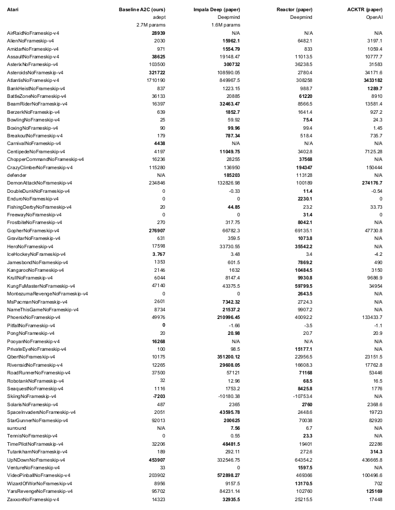

[](http://ci.heronsystems.com:12345/job/adeptRL/job/master/)
[](https://gitter.im/adeptRL/Lobby)

adept is a reinforcement learning framework designed to accelerate research 
by providing:
* a modular interface for using custom networks, agents, and environments
* baseline reinforcement learning models and algorithms for PyTorch
* multi-GPU support
* access to various environments
* built-in tensorboard logging, model saving, reloading, evaluation, and 
rendering
* proven hyperparameter defaults

This code is early-access, expect rough edges. Interfaces subject to change. 
We're happy to accept feedback and contributions.

**Read More**
* [Features](#features)
* [Installation](#installation)
* [Performance](#performance)
* [Quickstart](#quickstart)

**Documentation**
* [Architecture Overview](docs/api_overview.md)
* ModularNetwork Overview
* Resume training
* Evaluate a model
* Render environment

**Examples**
* Custom Network ([stub](examples/custom_network_stub.py) | example)
* Custom SubModule ([stub](examples/custom_submodule_stub.py) | [example](adept/networks/net1d/lstm.py))
* Custom Agent ([stub](examples/custom_agent_stub.py) | [example](adept/agents/actor_critic.py))
* Custom Environment (stub | [example](adept/environments/openai_gym.py))

## Features
**Agents / Networks**
* Actor Critic with Generalized Advantage Estimation
* Stateful networks (ie. LSTMs)
* Batch norm

**Scripts**
* Local (Single-GPU, A2C)
* Towered (Multi-GPU, A3C-variant)
* Importance Weighted Actor Learner Architectures, 
[IMPALA](https://arxiv.org/pdf/1802.01561.pdf) (Faster Multi-GPU)

**Environments**
* OpenAI Gym
* StarCraft 2 (unstable)

## Installation
**Dependencies:**
* gym
* PyTorch 1.x
* Python 3.5+
* We recommend CUDA 10, pytorch 1.0, python 3.6

**From source:**
* Follow instructions for [PyTorch](https://pytorch.org/)
* (Optional) Follow instructions for 
[StarCraft 2](https://github.com/Blizzard/s2client-proto#downloads)
```bash
git clone https://github.com/heronsystems/adeptRL
cd adeptRL
# Remove mpi, sc2, profiler if you don't plan on using these features:
pip install .[mpi,sc2,profiler]
```

**From docker:**
* [docker instructions](./docker/)

## Performance
* ~ 3,000 Steps/second = 12,000 FPS (Atari)
  * Local Mode
  * 64 environments
  * GeForce 2080 Ti
  * Ryzen 2700x 8-core
* Used to win a 
[Doom competition](https://www.crowdai.org/challenges/visual-doom-ai-competition-2018-track-2) 
(Ben Bell / Marv2in)

* Trained for 50M Steps / 200M Frames
* Up to 30 no-ops at start of each episode
* Evaluated on different seeds than trained on
* Architecture: [Four Convs](./adept/networks/net3d/four_conv.py) (F=32) 
followed by an [LSTM](./adept/networks/net1d/lstm.py) (F=512)
* Reproduce with `python -m adept.app local --logdir ~/local64_benchmark --eval 
-y --env <env-id>`

## Quickstart
**Train an Agent**  
Logs go to `/tmp/adept_logs/` by default. The log directory contains the 
tensorboard file, saved models, and other metadata.

```bash
# Local Mode (A2C)
# We recommend 4GB+ GPU memory, 8GB+ RAM, 4+ Cores
python -m adept.app local --env BeamRiderNoFrameskip-v4

# Towered Mode (A3C Variant, requires mpi4py)
# We recommend 2+ GPUs, 8GB+ GPU memory, 32GB+ RAM, 4+ Cores
python -m adept.app towered --env BeamRiderNoFrameskip-v4

# IMPALA (requires mpi4py and is resource intensive)
# We recommend 2+ GPUs, 8GB+ GPU memory, 32GB+ RAM, 4+ Cores
python -m adept.app impala --env BeamRiderNoFrameskip-v4

# StarCraft 2 (IMPALA not supported yet)
# Warning: much more resource intensive than Atari
python -m adept.app local --env CollectMineralShards

# To see a full list of options:
python -m adept.app -h
python -m adept.app help <command>
```

**Use your own Agent, Environment, Network, or SubModule**  
```python
"""
my_script.py

Train an agent on a single GPU.
"""
from adept.scripts.local import parse_args, main
from adept.networks import NetworkModule, NetworkRegistry, SubModule1D
from adept.agents import AgentModule, AgentRegistry
from adept.environments import EnvModule, EnvRegistry


class MyAgent(AgentModule):
    pass  # Implement


class MyEnv(EnvModule):
    pass  # Implement


class MyNet(NetworkModule):
    pass  # Implement


class MySubModule1D(SubModule1D):
    pass  # Implement


if __name__ == '__main__':
    agent_registry = AgentRegistry()
    agent_registry.register_agent(MyAgent)
    
    env_registry = EnvRegistry()
    env_registry.register_env()  # TODO user-friendliness
    
    network_registry = NetworkRegistry()
    network_registry.register_custom_net(MyNet)
    network_registry.register_submodule(MySubModule1D)
    
    main(
        parse_args(),
        agent_registry=agent_registry,
        env_registry=env_registry,
        net_registry=network_registry
    )
```
* Call your script like this: `python my_script.py --agent MyAgent --env MyEnv 
--custom-network MyNet`
* You can see all the args [here](adept/scripts/local.py)

## Acknowledgements
We borrow pieces of OpenAI's [gym](https://github.com/openai/gym) and 
[baselines](https://github.com/openai/baselines) code. We indicate where this
 is done.
