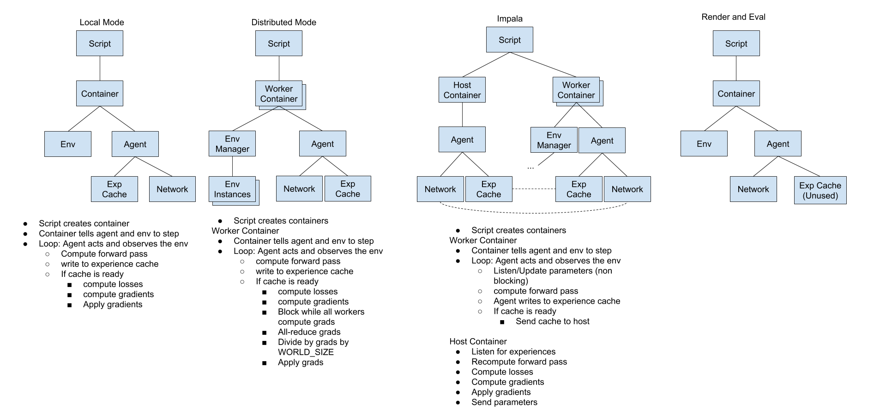

## API Reference

### Containers
Containers hold all of the application state. Each subprocess gets a container 
in Towered and IMPALA modes.
### Agents
An Agent acts on and observes the environment.
Currently only ActorCritic is supported. Other agents, such as DQN or ACER may 
be added later.
### Networks
Networks are not PyTorch modules, they need to implement our abstract 
NetworkModule or ModularNetwork classes. A ModularNetwork consists of a 
source nets, body, and heads.
### Environments
Environments run in subprocesses and send their observation, rewards,
terminals, and infos to the host process. They work pretty much the same way as 
OpenAI's code.
### Experience Caches
An Experience Cache is a Rollout or Experience Replay that is written to after 
stepping and read before learning.
